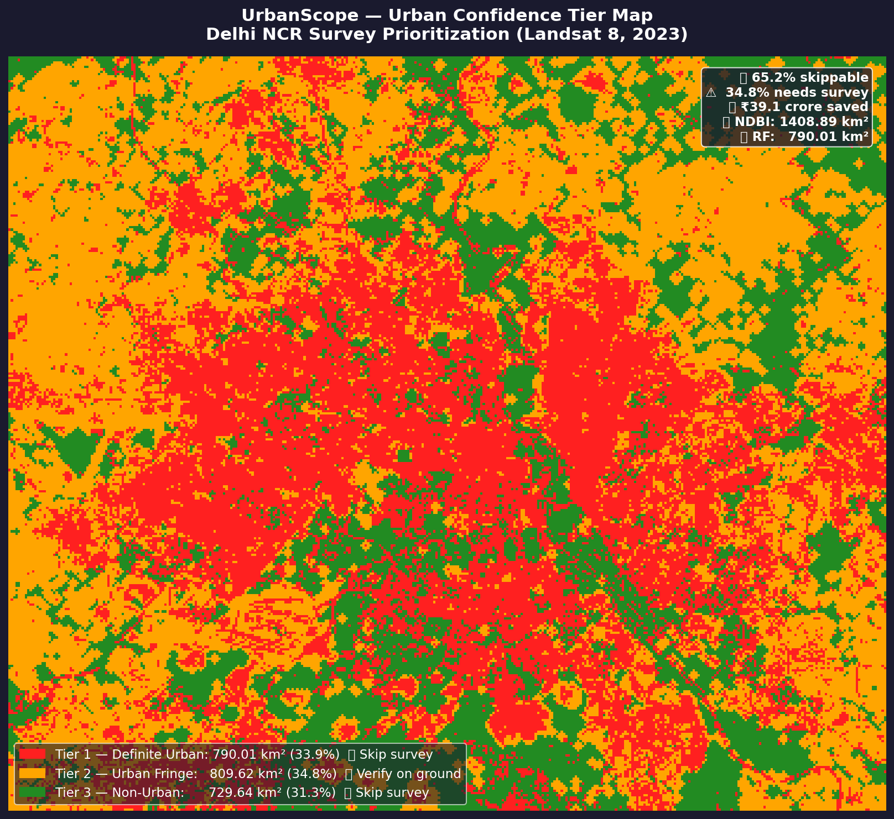
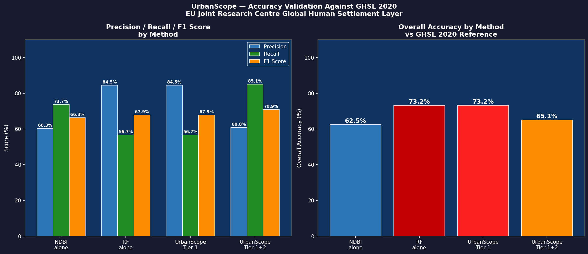
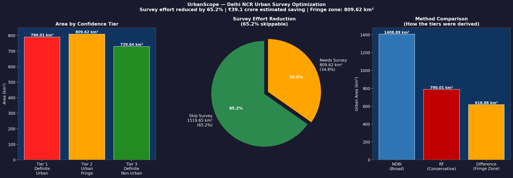

# UrbanScope 🛰️
### Satellite Urban Confidence Mapper — Delhi NCR

A satellite-based field survey optimization tool that uses ensemble 
NDBI index thresholding and Random Forest classification on Landsat 8 
imagery to assign confidence tiers to every pixel in Delhi NCR — 
identifying which areas can be classified directly from satellite data 
and which genuinely require physical ground verification.

**Validated against EU JRC Global Human Settlement Layer (GHSL 2018)**  
**F1 Score: 70.9% | Precision: 60.8% | Recall: 85.1%**

---

## The Problem
Traditional built-up area mapping requires field surveyors to 
physically verify land cover across the entire study area — an 
expensive, time-consuming process. For Delhi NCR (2,329 km²), 
this means deploying ~200 surveyors for ~3 months at a cost of 
~₹1.86 crore.

Not all areas need equal attention. Clearly urban zones and clearly 
rural zones can be identified from satellite data with high confidence. 
Only the transitional fringe requires physical verification.

## The Solution
UrbanScope runs two independent classifiers on the same Landsat 8 
image and uses their agreement/disagreement to assign confidence:
```
NDBI detects:  1,408 km² urban (broad, index-based)
RF detects:      790 km² urban (conservative, ML-based)
─────────────────────────────────────────────────────
Tier 1 — Both agree urban    →  790 km²  ❌ Skip survey
Tier 2 — Only NDBI detects   →  809 km²  ✅ Verify on ground  
Tier 3 — Both agree non-urban →  729 km²  ❌ Skip survey
```

## Key Results

| Metric | Value |
|--------|-------|
| Study Area | Delhi NCR (2,329 km²) |
| Satellite | Landsat 8 OLI, March–May 2023 |
| Tier 1 — Definite Urban | 790 km² (33.9%) |
| Tier 2 — Urban Fringe (survey needed) | 809 km² (34.8%) |
| Tier 3 — Definite Non-Urban | 729 km² (31.3%) |
| **Survey area reduction** | **65.2%** |
| **Estimated cost saving** | **₹1.20 crore** |
| **F1 Score (vs GHSL 2018)** | **70.9%** |

## Validation
Validated against the EU Joint Research Centre's Global Human 
Settlement Layer (GHSL 2018) — the standard reference dataset 
for urban mapping in peer-reviewed literature.

| Method | Accuracy | Precision | Recall | F1 |
|--------|----------|-----------|--------|----|
| NDBI alone | 62.5% | 60.3% | 73.7% | 66.3% |
| RF alone | 73.2% | 84.5% | 56.7% | 67.9% |
| **UrbanScope Tier 1+2** | **65.1%** | **60.8%** | **85.1%** | **70.9%** |

UrbanScope achieves the highest F1 score of all three methods.

## Output Maps

### Confidence Tier Map


### Validation Results


### Survey Optimization Statistics


## Methodology
```
1. Load Landsat 8 Collection 2 Level-2 imagery (Mar–May 2023)
2. Apply QA_PIXEL cloud + shadow masking
3. Compute NDBI, NDVI, MNDWI spectral indices
4. Method 1: NDBI threshold (65th percentile) + NDVI/MNDWI masks
5. Method 2: Random Forest (100 trees, 3 classes, water auto-masked)
6. Build 3-tier confidence map from method agreement/disagreement
7. Calculate area statistics per tier
8. Validate against GHSL 2018 using stratified random sampling
```

## Limitations
- GHSL reference data is 2018 vs our 2023 imagery (5-year gap 
  means some true urban growth counts as false positives)
- RF trained on 12 point samples — polygon training would 
  improve precision
- 30m Landsat resolution limits accuracy at urban boundaries
- Cost estimates based on industry averages
- Validated for Delhi NCR only — generalizability untested

## Tech Stack
- Google Earth Engine Python API
- geemap
- scikit-learn
- pandas, matplotlib, numpy
- Google Colab

## Data Sources
- Landsat 8 Collection 2 Level-2: USGS Earth Explorer
- GHSL 2018: EU Joint Research Centre via GEE
- Reference: `JRC/GHSL/P2023A/GHS_BUILT_C`

## Related Work in This Repository
This project is part of a three-part urban analysis series:

| Project | Description | Key Result |
|---------|-------------|------------|
| [NDBI Urban Mapping](../delhi-urban-expansion) | Multi-temporal built-up area change detection 2010–2023 | +47.7% growth |
| [RF Classification](../urban_expansion_RF) | Random Forest land cover classification | 4-class map |
| **UrbanScope** (this repo) | Confidence mapping for survey optimization | 65.2% effort reduction |

## Author
**Aarush Goyal**  
Student, University School of Automation and Robotics (USAR)  
Guru Gobind Singh Indraprastha University (GGSIPU), New Delhi
